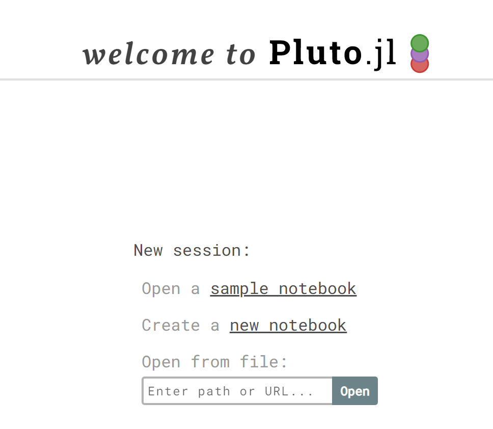

# Machine Learning Tutorial with Julia 

This is a simple tutorial illustrating the workflow of a machine learning project. 
It consists of fitting a model on a synthetic dataset. It provides an interactive way to explore the effect of hyperparameters on model performance. 

## Installation 

- Install julia 1.8, download it from here: https://julialang.org/downloads/ 
- Add julia to your path
- clone this project: `git clone https://github.com/MaximeBouton/JuliaMachineLearningTutorial.git`
- go to the directory of the project and run julia: 
```
julia
               _
   _       _ _(_)_     |  Documentation: https://docs.julialang.org
  (_)     | (_) (_)    |
   _ _   _| |_  __ _   |  Type "?" for help, "]?" for Pkg help.
  | | | | | | |/ _` |  |
  | | |_| | | | (_| |  |  Version 1.8.1 (2022-09-06)
 _/ |\__'_|_|_|\__'_|  |  Official https://julialang.org/ release
|__/                   |

julia>
``` 
- In julia, install the pluto package:
```julia
julia>using Pkg; Pkg.installed("Pluto")
```

## Running the notebook 

Open julia and run the following: 

```julia 
julia> using Pluto
julia> Pluto.run()
```

A window should pop up in your browser with a screen that looks like this: 



Enter the name of the notebook in the field: `machine_learning_tutorial_notebook.jl`

The first time you open it, it will install all the machine learning packages and it might take a while to start.
